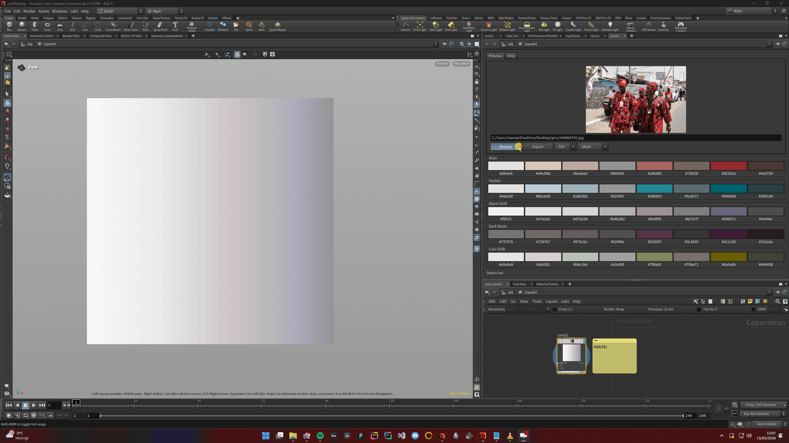

# Hywall
Hywall is a tool for generating inspiring colour palettes from images in Houdini. 
Generates 5 palette variants: Main, Pastels, Warm Shift, Dark Mode, and Cool Shift.

## Features
- Generate colour palettes from any image
- 5 palette variants: Main, Pastels, Warm Shift, Dark Mode, Cool Shift
- Click a colour swatch to copy hex to the clipboard
- Click a palette row to apply as a colour ramp to a selected node (Node needs to have a ramp)
- Export palettes to CSV, JSON, GPL, CSS
- Colour space selector for exports (sRGB, ACEScg, OKLab, etc.)

## Installation
1. Download or clone into your Houdini User folder:
        
        Linux
            cd ~/houdini21.0
            git clone https://github.com/yourname/hywall

        Windows
               cd %USERPROFILE%\Documents\houdini21.0
               git clone https://github.com/yourname/hywall
           

2. Copy the package file (create `packages/` if it doesn't exist):

        Linux
            cp ~/houdini21.0/hywall/hywall.json ~/houdini21.0/packages/
        Windows
            copy %USERPROFILE%\Documents\houdini21.0\hywall\hywall.json %USERPROFILE%\Documents\houdini21.0\packages\

3. Restart Houdini
4. Open via **Parameter Panel > Hywall**

> If you placed the repo outside your Houdini prefs folder, edit `hywall.json` and replace `$HOUDINI_USER_PREF_DIR/hywall ` with the full path to the repo.

## Requirements
- Houdini 21+ (Pillow and Coloraide are bundled)

## Usage
- Browse or type a path and press Enter to load an image
- Click any colour swatch to copy its hex value
- Select a node with a colour ramp parameter, then click a palette row to apply it
- Choose export format and colour space, then click Export

## License
MIT

## Credits
Developed by [Hakeem Adam](https://hakeemadam.info).
Inspired by [Pywal](https://github.com/dylanaraps/pywal) and [Pastel](https://github.com/sharkdp/pastel). 